  

  

  💡 <i>I focus on <b>Data Integrity</b>, <b>Distributed Systems</b>, and <b>High-Efficiency Architecture</b>.</i>

---

# 🧑‍💻 About Me

> ### 🚀 **Backend Engineer** specialized in scalable and data-intensive systems
> **"Engineering robust backend solutions that align business logic with system performance."**

| Category | Key Achievements & Focus | Main Stack |
| :--- | :--- | :--- |
| **Scalability** | Built asynchronous messaging & settlement systems for **5M+ Transactions** |   |
| **Data Engine** | Designed real-time analytics pipelines with AI-driven **ElasticSearch** indexing |   |
| **Optimization** | Reduced API load by **70%** via **PostGIS** spatial queries & 3-Tier caching |   |
| **Security** | Implemented **RBAC** and **JWT-based** authentication for secure data access |   |

---

# 🛠 Technical Stack

<table>
  <tr>
    <td><b>Backend</b></td>
    <td>
      
      
      
      
      
    </td>
  </tr>
  <tr>
    <td><b>Storage</b></td>
    <td>
      
      
      
      
      
    </td>
  </tr>
  <tr>
    <td><b>Infra</b></td>
    <td>
      
      
      
    </td>
  </tr>
  <tr>
    <td><b>AI/ML</b></td>
    <td>
      
      
    </td>
  </tr>
</table>

---

# 📂 Main Projects

### 🏗️ Large-scale Batch & Messaging Platform
- **Impact:** Successfully processed **1M users** and **5M+ transactions** via high-traffic settlement system.
- **Tech:**        
- **Detail:** Optimized asynchronous messaging and ensured data integrity using **Spring Batch Meta-data** and fault-tolerant design.
- 🔗[async-settlement-system](https://github.com/CoderGogh/async-settlement-system)

---

### 🤖 AI-powered Customer Analytics System
- **Impact:** Automated semantic analysis and real-time reporting for large-scale consultation logs.
- **Tech:**           
- **Detail:** Enhanced search performance via **Data Denormalization** in MongoDB and customized **Elasticsearch tokenizers**.
- 🔗[AI-Based-CRM](https://github.com/4Ureca)

---

### ⚡ EV Charging Information System
- **Impact:** Provided real-time, optimized charging station data through spatial data processing.
- **Tech:**       
- **Detail:** Reduced API latency and overhead by implementing **PostGIS spatial queries** and a **3-tier caching strategy**.
- 🔗[EON(Front-End)](https://github.com/CoderGogh/Eon-FrontEnd-Server) & 🔗[EON(Back-End)](https://github.com/CoderGogh/Eon-BackEnd-Server)

---

## 📊 GitHub Stats

<table align="center">
  <tr>
    <td align="center" style="border: none;">
      
    </td>
    <td align="center" style="border: none;">
      
    </td>
  </tr>
</table>

  

